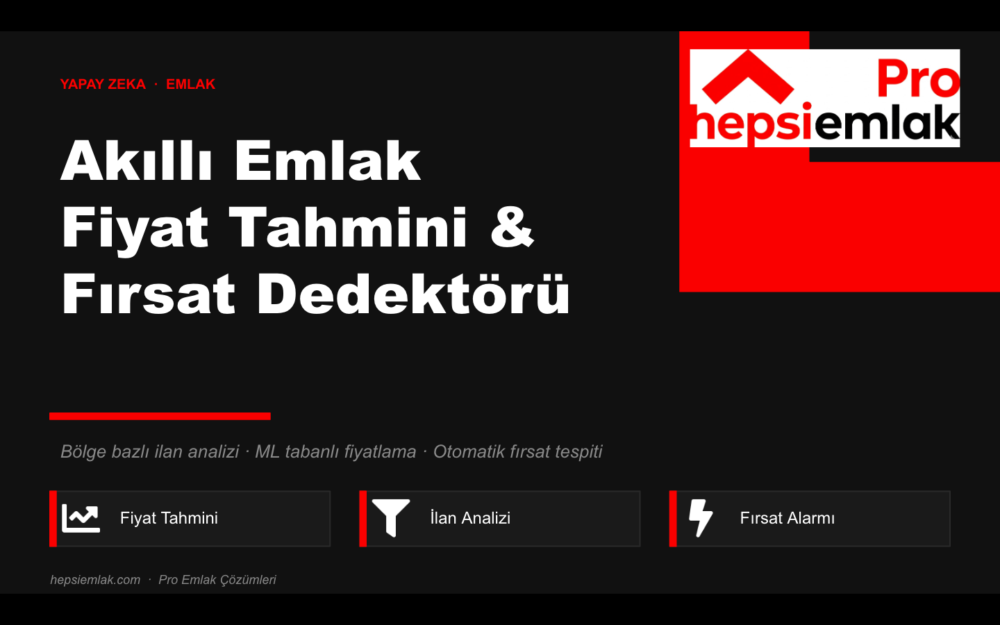
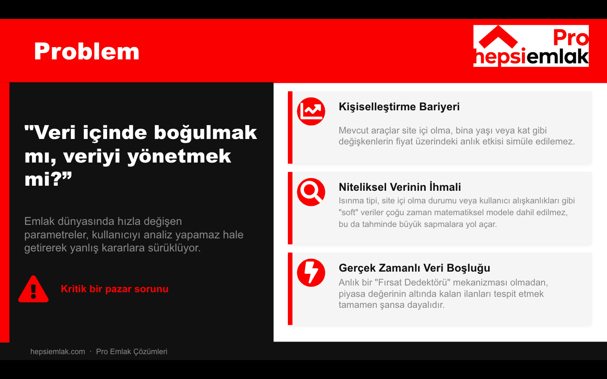
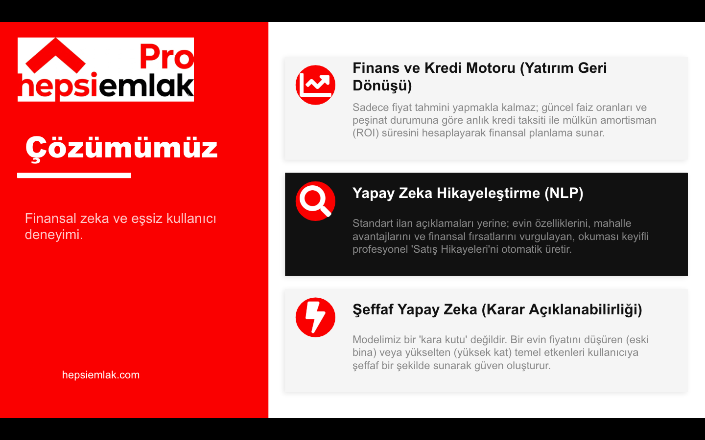
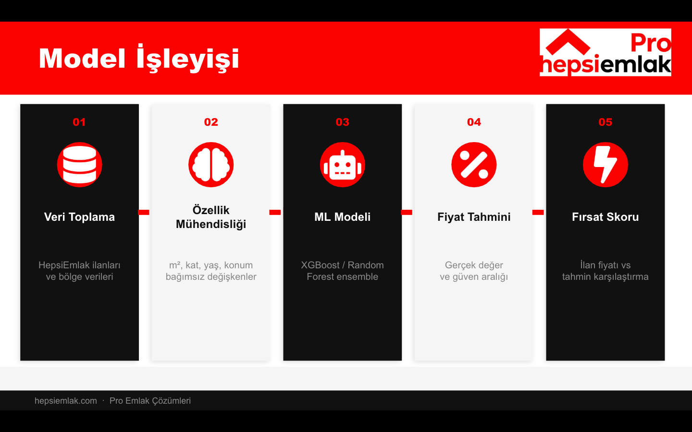
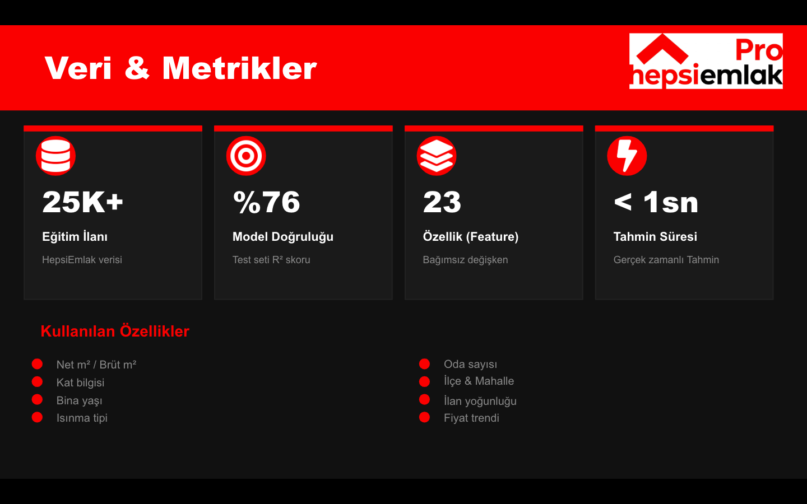
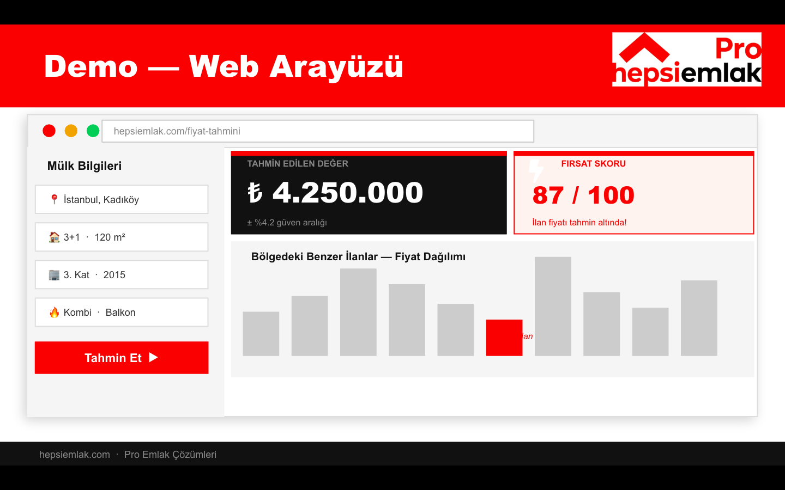

# 🏠 İstanbul Emlak Fiyat Tahminleme & Yatırım Analizörü

### 1. Vizyon ve Problem Tanımı
Emlak piyasasındaki "Doğru fiyat nedir?" sorununa getirdiğimiz yaklaşım:

---

### 2. Geliştirdiğimiz Çözümler
Modelimizin sunduğu teknolojik ve finansal zeka çözümleri:

> **🚀 Bireysel Katkım (Selen İmahanoğlu):**
> Bu projede bir veri bilimci olarak, sistemi standart bir tahmin modelinin ötesine taşıyan ve ürüne dönüştüren **4 kritik modülü** bizzat geliştirdim:
> 1. **Bölgesel İlan Analizi:** Evleri sokağından bağımsız düşünmeyip, mahalle trendleriyle kıyaslayan lokasyon zekası.
> 2. **Finans ve Kredi Motoru:** Güncel faizlerle kredi taksiti ve yatırım geri dönüş (Amortisman/ROI) hesaplaması.
> 3. **NLP Hikayeleştirme:** Karmaşık verileri profesyonel emlak satış metinlerine dönüştüren otomatik içerik sistemi.
> 4. **Şeffaf Yapay Zeka (XAI):** SHAP kütüphanesi ile modelin karar mekanizmasını kullanıcıya açıklayan şeffaflık katmanı.

---

### 3. Teknik Mimari ve Metrikler
Verinin işlenme süreci ve modelimizin başarı kanıtları:

---

### 4. Canlı Ürün (Demo)
Geliştirdiğimiz Streamlit tabanlı son kullanıcı arayüzü:

